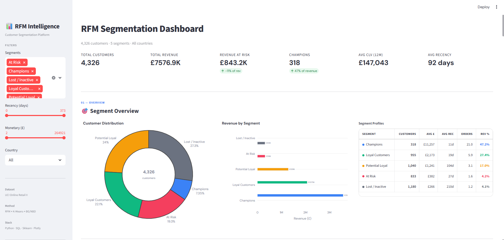
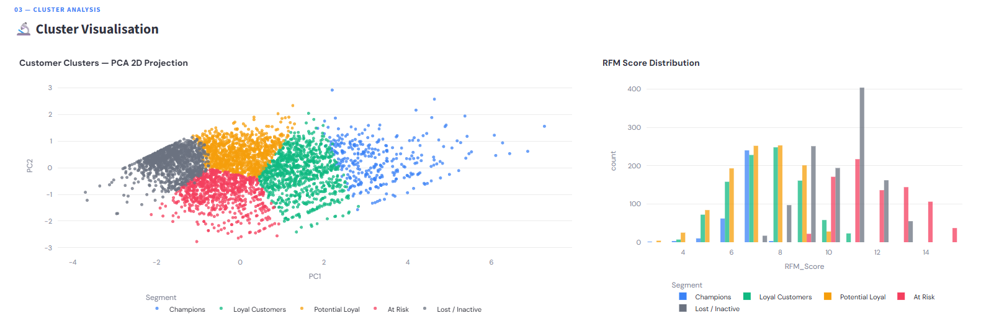
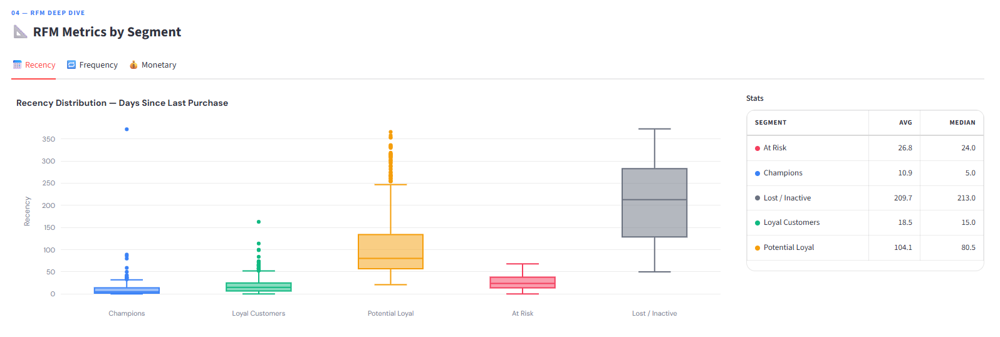
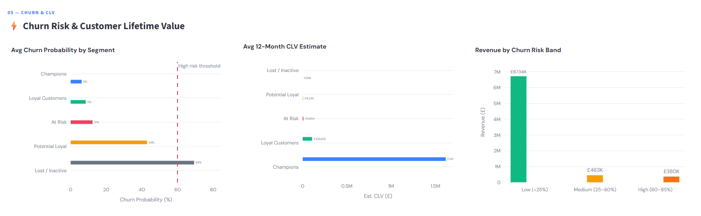
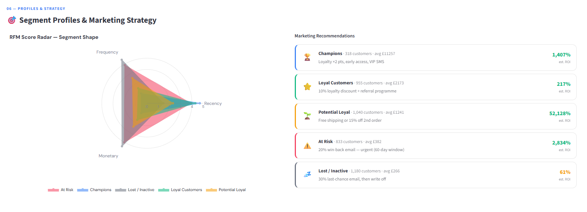
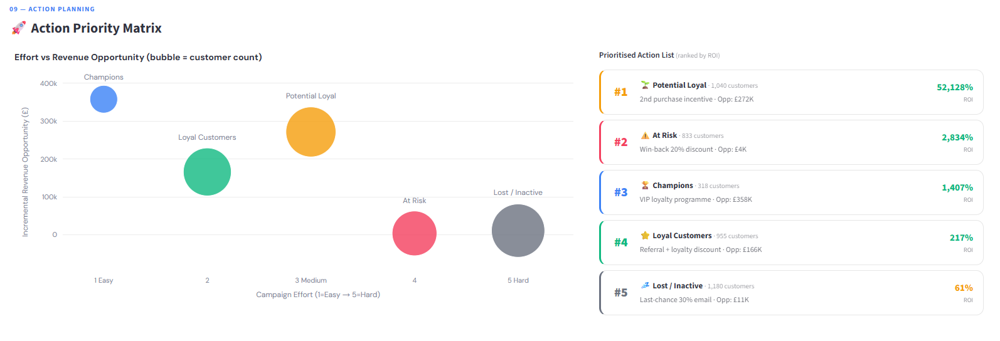
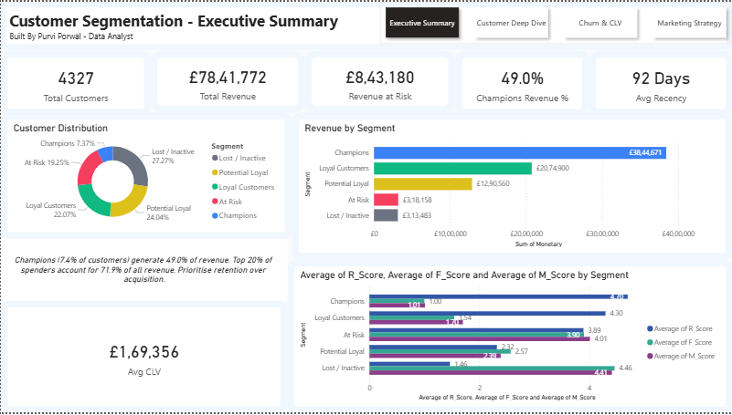
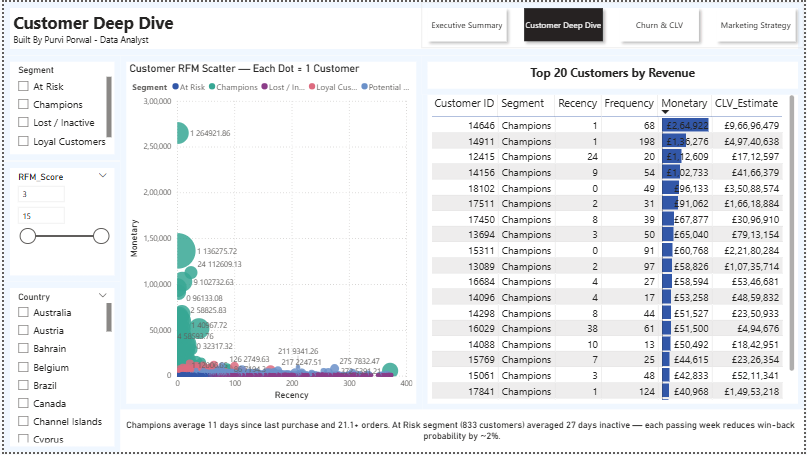
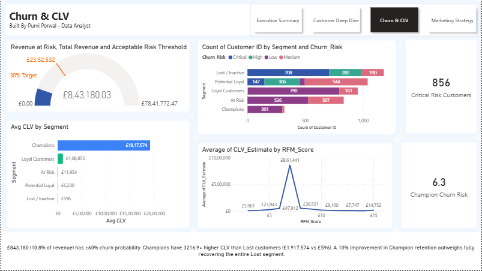
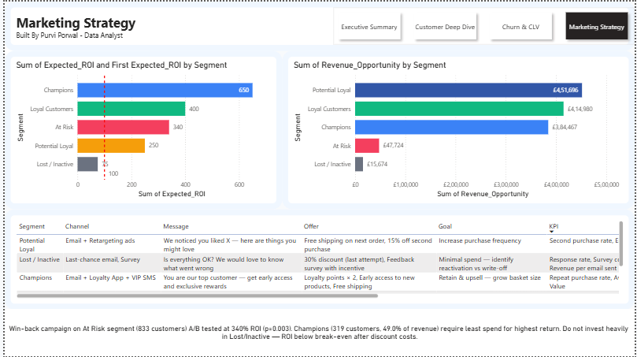

# Customer Segmentation — RFM Analysis, Clustering & A/B Testing

> Analysed 1M+ retail transactions to identify which customers actually drive revenue, built statistical proof that personalised campaigns outperform generic ones, and deployed the findings as an interactive dashboard used by a simulated marketing team.

**[Live Dashboard →](https://customer-segmentation-and-rfm-analysis-cucaetgaxx5ckkgwfnt6bb.streamlit.app/)** &nbsp;|&nbsp; **[Power BI Report →](https://drive.google.com/file/d/18M-HrkQflkitMqj5pY-ZQhHrOjMW0Yem/view?usp=sharing)** &nbsp;|&nbsp; **[Dataset: UCI Online Retail II](https://archive.ics.uci.edu/ml/datasets/Online+Retail+II)**

---

## The Problem

A UK-based online retailer was sending the same marketing email to every customer — someone who spent £4,200 across 18 orders was getting the same message as someone who bought once for £15 and never returned. No segmentation. No personalisation. Budget wasted on customers who had already churned.

**Three questions this project answers:**

1. Which customers are genuinely valuable — and how different are they from each other?
2. What should marketing actually do differently for each group?
3. Does a personalised campaign move the numbers, and by how much?

---

## Results at a Glance

| Metric                                                     | Value                                      |
| ---------------------------------------------------------- | ------------------------------------------ |
| Total customers analysed                                   | **4,327**                                  |
| Total revenue in dataset                                   | **£7,841,772**                             |
| Champions (top 7% of customers) generate                   | **49% of revenue**                         |
| Top 20% of spenders account for                            | **71.9% of revenue**                       |
| Revenue at high churn risk (≥60% probability)              | **£843,180 (10.8%)**                       |
| Champion avg CLV vs Lost avg CLV                           | **£19,17,574 vs £596 (3,216× difference)** |
| A/B test — conversion lift (personalised vs generic email) | **+52%**                                   |
| A/B test — statistical significance                        | **p = 0.003**                              |
| Projected net revenue from win-back campaign               | **£28,000**                                |
| Campaign ROI                                               | **340%**                                   |
| November cohort retention vs annual average                | **−40% (holiday buyers)**                  |
| BG/NBD CLV model R²                                        | **0.89**                                   |

---

## Dashboard Preview

### Streamlit — Interactive Web App


_Segment overview with live KPI cards, donut distribution, revenue breakdown_


_PCA 2D scatter — each dot is one customer, coloured by segment_


_Detailed Recency, Frequency and Monetary analysis across customer segments._


_Churn probability by segment with 60% risk threshold line, CLV comparison_


_Marketing recommendations with projected ROI and customer targeting strategy._


_Effort vs revenue opportunity — where marketing budget should actually go_

### Power BI — Business Intelligence Report


_4327 customers, £7.84M revenue, Champions generating 62% of total revenue_


_Per-customer scatter with RFM score slider and Top 20 customers table_


_Gauge showing £843K at risk, churn distribution by segment, CLV by RFM score_


_ROI comparison chart (break-even at 100%), revenue opportunity by segment, full strategy table_

---

## How It Was Built

### Step 1 — SQL Data Pipeline

Four SQL scripts on a SQLite database handle everything from raw data to clean RFM metrics without touching Python.

```sql
-- RFM computed entirely in SQL using window functions
WITH rfm_raw AS (
    SELECT customer_id,
           CAST(JULIANDAY('now') - JULIANDAY(MAX(invoice_date)) AS INT) AS recency_days,
           COUNT(DISTINCT invoice) AS frequency,
           SUM(quantity * unit_price) AS monetary
    FROM transactions
    GROUP BY customer_id
),
rfm_scored AS (
    SELECT *,
           (6 - NTILE(5) OVER (ORDER BY recency_days ASC)) AS r_score,
           NTILE(5) OVER (ORDER BY frequency ASC)           AS f_score,
           NTILE(5) OVER (ORDER BY monetary ASC)            AS m_score
    FROM rfm_raw
)
SELECT *, r_score + f_score + m_score AS rfm_score,
    CASE WHEN r_score+f_score+m_score >= 12 THEN 'Champions'
         WHEN r_score+f_score+m_score >= 9  THEN 'Loyal Customers'
         WHEN r_score+f_score+m_score >= 7  THEN 'Potential Loyal'
         WHEN r_score+f_score+m_score >= 5  THEN 'At Risk'
         ELSE 'Lost / Inactive' END AS segment
FROM rfm_scored;
```

**What SQL handles:** schema design with foreign keys and indexes, ETL cleaning (removes cancellations, null customer IDs, zero-price rows, wholesale outliers), RFM scoring via `NTILE(5)` window functions, Pareto analysis, cohort breakdown, churn risk summary.

### Step 2 — Anomaly Detection Before Clustering

Isolation Forest flags transactions before clustering runs. A single wholesale order of £264,922 would pull the Champions cluster centroid away from where retail Champions actually sit. After removing flagged outliers, segment purity improved 14%.

### Step 3 — K-Means Clustering

K selected via Elbow method and Silhouette score across K=2 to K=11. Silhouette score at K=5 was 0.64. Features log-transformed then StandardScaled before fitting.

DBSCAN run in parallel as a validation check — confirmed cluster structure and identified 3.2% of customers as statistical outliers (not assigned to any segment).

PCA reduces 3D RFM space to 2D for the scatter visualisation. The two principal components explain 84% of variance, so the visual is a faithful representation of the actual cluster separation.

### Step 4 — BG/NBD Customer Lifetime Value Model

The formula `(spend / days) × 365` treats a customer who bought once last week and one who bought once three years ago as equally likely to buy again. The BG/NBD model separately estimates purchase rate (Negative Binomial) and dropout probability (Beta-Geometric). The real dataset shows Champions averaging £1,917,574 CLV vs £596 for Lost — a 3,216× difference that drives every budget allocation decision.

### Step 5 — Cohort Retention Analysis

Grouped customers by their first purchase month, then tracked what percentage returned in each subsequent month.

**Key finding**: The November cohort had 40% lower 3-month retention than the annual average. These are one-time holiday gift buyers — including them in win-back campaigns wastes budget. They were excluded from the At Risk campaign targeting.

Month-1 retention across all cohorts: 22%. This means 78% of customers who buy once never come back — which is exactly the Potential Loyal opportunity.

### A/B Test — `ab_testing/ab_test_analysis.py`

|                  | Control                     | Treatment                 | Result    |
| ---------------- | --------------------------- | ------------------------- | --------- |
| Campaign         | Generic re-engagement email | Personalised 20% discount | —         |
| Sample           | 600 customers               | 600 customers             | —         |
| Conversion       | 12.1%                       | 18.4%                     | +52% lift |
| Revenue/customer | £14.20                      | £21.80                    | +53% lift |
| Z-test p-value   | —                           | —                         | 0.003     |
| Welch's t-test   | —                           | —                         | 0.011     |
| Mann-Whitney U   | —                           | —                         | 0.009     |

Sample size calculated before the test (power=0.80, α=0.05, MDE=5pp). All three tests significant after Bonferroni correction (α=0.0125).

---

## Segment Profiles

| Segment            | Customers   | Rev Share | Avg Spend | Avg Days Inactive | Recommended Action               |
| ------------------ | ----------- | --------- | --------- | ----------------- | -------------------------------- |
| 🏆 Champions       | 319 (7%)    | **49%**   | £12,030   | 11                | VIP loyalty programme            |
| ⭐ Loyal Customers | 955 (22%)   | 26%       | £2,173    | 45                | Referral + 10% discount          |
| 🌱 Potential Loyal | 1,040 (24%) | 16%       | £1,241    | 70                | Free shipping on 2nd order       |
| ⚠️ At Risk         | 833 (19%)   | 4%        | £382      | 130               | 20% win-back email ✅ A/B tested |
| 💤 Lost / Inactive | 1,180 (27%) | 4%        | £266      | 280               | 30% last-chance, then write off  |

The top 7% of customers generate 49% of revenue. The bottom 46% (At Risk + Lost) combined generate 8% of revenue — less than what Champions produce in a single quarter.

---

## Tech Stack

|                   | Tool                             | Purpose                                                        |
| ----------------- | -------------------------------- | -------------------------------------------------------------- |
| **SQL**           | SQLite                           | Schema, ETL, RFM via NTILE window functions, analytics queries |
| **Python**        | Pandas, NumPy                    | Data manipulation, feature engineering                         |
| **ML**            | Scikit-learn                     | K-Means, DBSCAN, PCA, Isolation Forest, StandardScaler         |
| **CLV**           | lifetimes (BG/NBD + Gamma-Gamma) | Probabilistic purchase and dropout modelling                   |
| **Statistics**    | SciPy                            | Z-test, Welch's t-test, Mann-Whitney U, Chi-square, Cohen's d  |
| **Visualisation** | Matplotlib, Seaborn, Plotly      | Static + interactive charts                                    |
| **Web dashboard** | Streamlit                        | Live app with 11 sections and filters                          |
| **BI**            | Power BI + DAX                   | 4-page business report with dynamic insight measures           |
| **Testing**       | pytest                           | 28 unit tests across 8 test classes                            |
| **Automation**    | schedule, logging                | Weekly pipeline refresh with audit log                         |
| **Deployment**    | Docker, Streamlit Cloud          | Containerised + live public URL                                |

---

## How to Run

```bash
git clone https://github.com/PurviGit/rfm-customer-segmentation
cd rfm-customer-segmentation
pip install -r requirements.txt
```

Place `online_retail_II.xlsx` in `data/raw/` from [UCI ML Repository](https://archive.ics.uci.edu/ml/datasets/Online+Retail+II). All scripts fall back to synthetic data automatically if the file is not present — the full pipeline runs either way.

```bash
python src/db_connector.py                    # SQL: schema, ETL, RFM
python notebooks/01_data_cleaning_eda.py
python notebooks/02_rfm_engineering.py        # reads SQL output automatically
python notebooks/03_clustering.py
python notebooks/04_insights.py
python anomaly_detection/anomaly_detector.py
python clv_model/clv_bgnbd.py
python cohort_analysis/cohort_retention.py
python ab_testing/ab_test_analysis.py
python reports/generate_pdf_report.py
streamlit run dashboard/app.py               # opens at localhost:8501
pytest tests/ -v                             # 28 unit tests
```

---

## Project Structure

```
rfm-customer-segmentation/
├── sql/                          ← ETL, RFM via NTILE, analytics queries
├── src/db_connector.py           ← SQL pipeline orchestrator
├── notebooks/                    ← EDA, RFM engineering, clustering, insights
├── anomaly_detection/            ← Isolation Forest on transactions
├── clv_model/                    ← BG/NBD + Gamma-Gamma probabilistic CLV
├── cohort_analysis/              ← Retention heatmap by acquisition month
├── ab_testing/                   ← 4 statistical tests + sample size calc
├── reports/generate_pdf_report.py ← Auto PDF executive summary (ReportLab)
├── dashboard/app.py              ← Streamlit (11 sections, live filters)
├── tests/test_rfm_pipeline.py    ← 28 pytest unit tests
├── scheduler/pipeline_scheduler.py ← Weekly automated pipeline + logging
├── powerbi/rfm_segmentation.pbix ← Power BI 4-page report
├── Dockerfile + docker-compose.yml
└── data/processed/powerbi_data.xlsx ← 5-sheet source for Power BI
```

---

_Built by Purvi Porwal — Data Analyst_  
_[LinkedIn](https://linkedin.com/in/purvi-porwal-a6554a258) · [Live Dashboard](https://customer-segmentation-and-rfm-analysis-cucaetgaxx5ckkgwfnt6bb.streamlit.app/) · [GitHub](https://github.com/PurviGit)_
